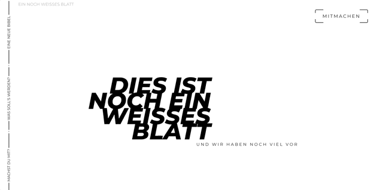
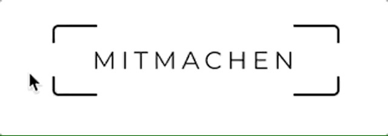

# EWB Website
This is a project requested by a friend, so the texting is made by him.

## Goal
- This project was supposed to challenge me to dive into new Topics/Plugins and improve my workflow in learning with documentation
- My personal goal for this project was to learn how parallax works and get full Page color transitions
- Write a page template before starting into the specific pages

## Result
### Page showcase

#### Page look & feel showcase

(The stuttering is the result of the scroll speed my mouse uses)

#### Personal highlight

## Tools & Libraries used
- React
- Gatsby
- styled Components
- react-parallax
- use-is-in-viewport (personal favorite)

## Learnings
This Project had quite some ups & downs. I started of with the idea of Parallax and full Page color transitions. After coding both in vanilla js I experienced that changing things in a list of px-based breakpoints can be quite a pain.

So I wrapped things up and started over rebuilding all pages with react Spring, since I liked the way Elements keep scrolling a bit after stopping to do so. But the way elements get positioned didn't work as intended with the full page color transitions.

After a short break which includes a new job @edyouacted I came back to the project with improved skills & rebuilt the website a third time.
this time I used a combination of react-parallax and use-is-in-viewport and it worked just great.

Tl:dr
- As cool as vanilla js can be, sometimes Plugins give some serious quality of life upgrades.
- A deeper dive into documentations can save a lot of work & time
- A good selfmade template feels just about right to have - I will definitly stick with them.

### New:
- PARALLAX (!Yeah caps are intended!)
- Viewport based animations with use-is-in-viewport
- Basics with React Spring
- Full Page Animations which affect all components

## Next Steps
- Improve Micro Animations (That Button gave me chills everytime I looked at it)
- Expand my Tech Stack (Vue might be next)
